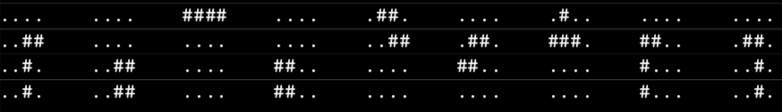

# fillit
Fit Tetriminos together to shape the smallest possible square (a 2 member project).

The program take only one parameter: a file that contains a list of Tetriminos to assemble

usage : ./fillit source_file

Each Tetrimino must be described with 4 lines of 4 characters, each line followed by a new line.
A Tetrimino is a classic piece of Tetris composed of 4 blocks, where blocks are represented by '#'.
Empty characters are represented by '.'.
Each block of a Tetrimino must touch at least one other block on any of its 4 sides.
A rotated Tetrimino describes a different Tetrimino, this program will not rotate any pieces.

Examples of valid descritpions of Tetriminos:

Examples of invalid descriptions of Tetriminos:

The goal of this program is to arrange all the given Tetriminos with each other in order to make the smallest possible square. Among all possible solutions for the smallest square, the one where Tetriminos are placed on their most upper-left position is selected. In the solution, each Tetrimino will be assgined a capital letter in accordance to the order it appearred in the file. The maximum number of Tetriminos that can be passed in a file is, therefore, 26.

Here is an example:

